# Strapi Content Embeddings - Architecture Guide

A comprehensive guide to understanding how the Strapi Content Embeddings plugin works, designed for new engineers and beginners.

## Table of Contents

1. [Overview](#overview)
2. [System Architecture](#system-architecture)
3. [Core Concepts](#core-concepts)
4. [Embedding Creation Flow](#embedding-creation-flow)
5. [Content Chunking](#content-chunking)
6. [Content Preprocessing](#content-preprocessing)
7. [Vector Storage](#vector-storage)
8. [RAG Query Flow](#rag-query-flow)
9. [Database Sync](#database-sync)
10. [MCP Integration](#mcp-integration)

---

## Overview

This plugin enables **semantic search** and **RAG (Retrieval-Augmented Generation)** capabilities for Strapi CMS by:

1. Converting text content into **vector embeddings** using OpenAI
2. Storing embeddings in **Neon PostgreSQL** with pgvector
3. Enabling similarity search to find related content
4. Providing a chat interface that answers questions using your content

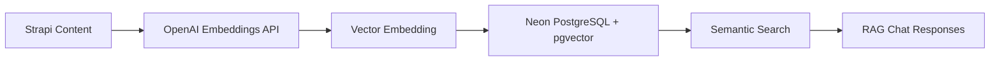

---

## System Architecture

### High-Level Architecture

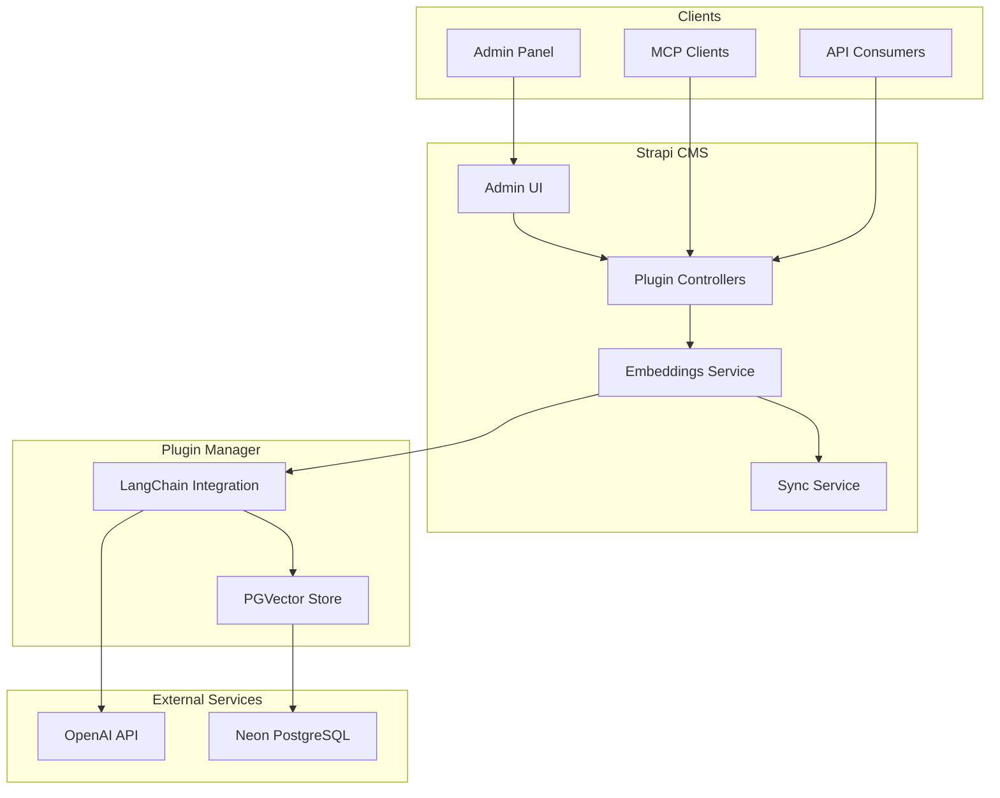

### Component Overview

| Component | Purpose |
|-----------|---------|
| **Admin UI** | React components for managing embeddings |
| **Controllers** | HTTP request handlers (REST API) |
| **Embeddings Service** | Core business logic for CRUD operations |
| **Sync Service** | Database synchronization between Strapi and Neon |
| **Plugin Manager** | LangChain/OpenAI/PGVector integration |
| **Neon PostgreSQL** | Vector storage with pgvector extension |

---

## Core Concepts

### What is a Vector Embedding?

A vector embedding is a numerical representation of text that captures its semantic meaning. Similar texts have similar vectors.

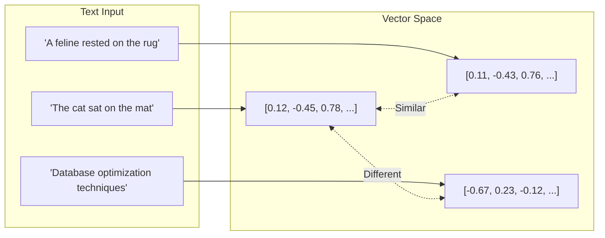

### Dual Database Storage

The plugin stores data in **two databases**:

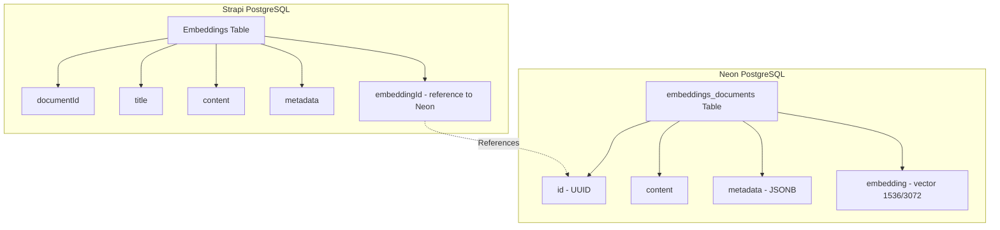

**Why two databases?**
- **Strapi DB**: Manages content, relationships, and admin features
- **Neon DB**: Optimized for vector similarity search with pgvector

---

## Embedding Creation Flow

### Step-by-Step Process

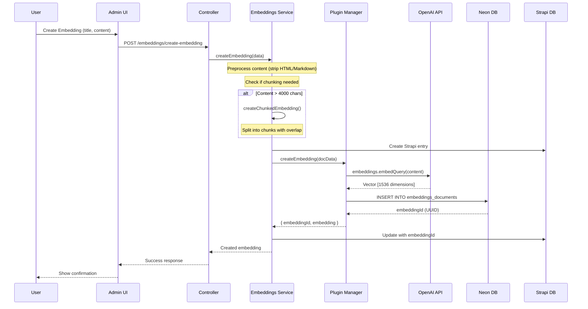

### Code Flow

```
User Input
    │
    ▼
┌─────────────────────────────────────────────────────────────┐
│ Controller: createEmbedding()                               │
│ server/src/controllers/controller.ts                        │
└─────────────────────────────────────────────────────────────┘
    │
    ▼
┌─────────────────────────────────────────────────────────────┐
│ Service: createEmbedding()                                  │
│ server/src/services/embeddings.ts                           │
│                                                             │
│ 1. Preprocess content (strip HTML/Markdown)                 │
│ 2. Check if content needs chunking                          │
│ 3. Create Strapi DB entry                                   │
│ 4. Call Plugin Manager to create vector                     │
└─────────────────────────────────────────────────────────────┘
    │
    ▼
┌─────────────────────────────────────────────────────────────┐
│ Plugin Manager: createEmbedding()                           │
│ server/src/plugin-manager.ts                                │
│                                                             │
│ 1. Call OpenAI embeddings API via LangChain                 │
│ 2. Insert vector into Neon DB                               │
│ 3. Return embeddingId and vector                            │
└─────────────────────────────────────────────────────────────┘
```

---

## Content Chunking

### Why Chunk Content?

- Embedding models have **token limits** (~8000 tokens)
- Smaller chunks enable **more precise** search results
- Overlapping chunks preserve **context** between sections

### Chunking Algorithm

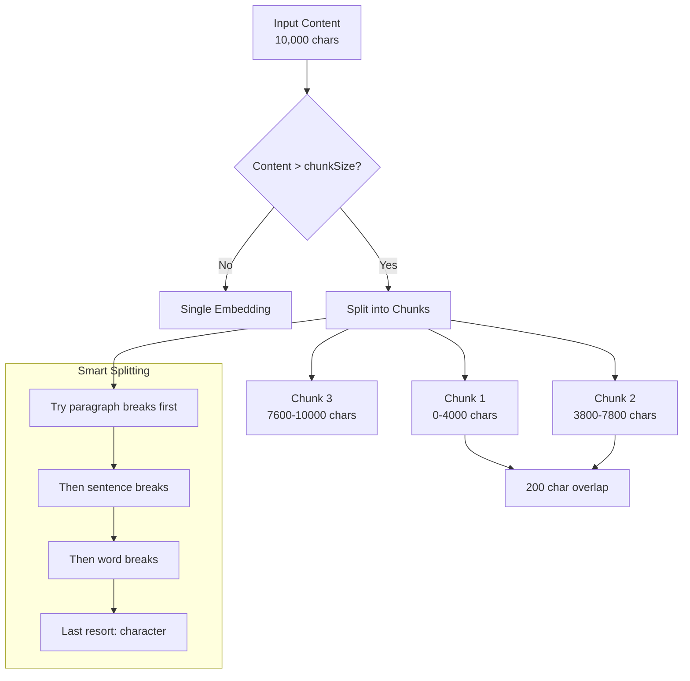

### Chunk Configuration

```typescript
{
  chunkSize: 4000,      // Max characters per chunk
  chunkOverlap: 200,    // Overlap between chunks
  autoChunk: true       // Enable automatic chunking
}
```

### Chunk Metadata Structure

Each chunk stores metadata linking it to other chunks:

```json
{
  "isChunk": true,
  "chunkIndex": 1,
  "totalChunks": 3,
  "startOffset": 3800,
  "endOffset": 7800,
  "originalTitle": "My Long Document",
  "parentDocumentId": "abc-123",
  "estimatedTokens": 950
}
```

### Splitting Priority

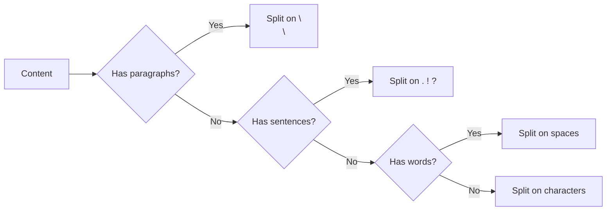

---

## Content Preprocessing

### Why Preprocess?

Raw HTML/Markdown adds noise without semantic value:

```
Before: "## Features\n- **Fast** search\n- <b>Reliable</b>"
After:  "Features: Fast search. Reliable"
```

Both mean the same thing, but the cleaned version creates better embeddings.

### Preprocessing Pipeline

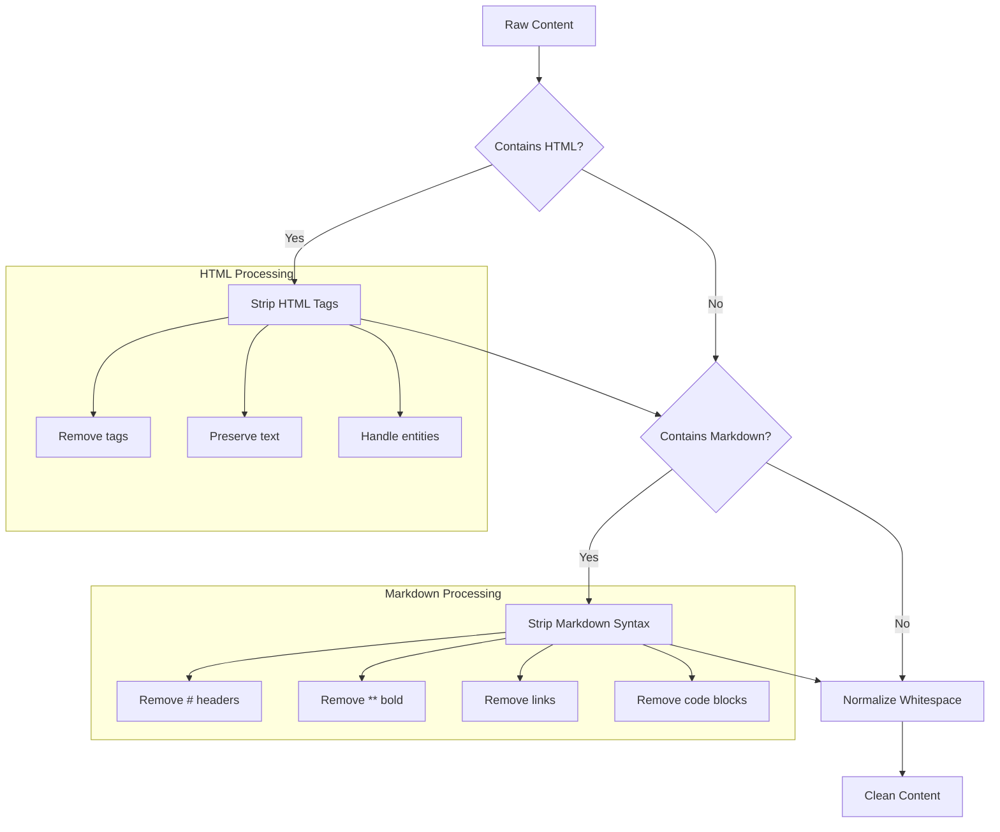

### Detection Logic

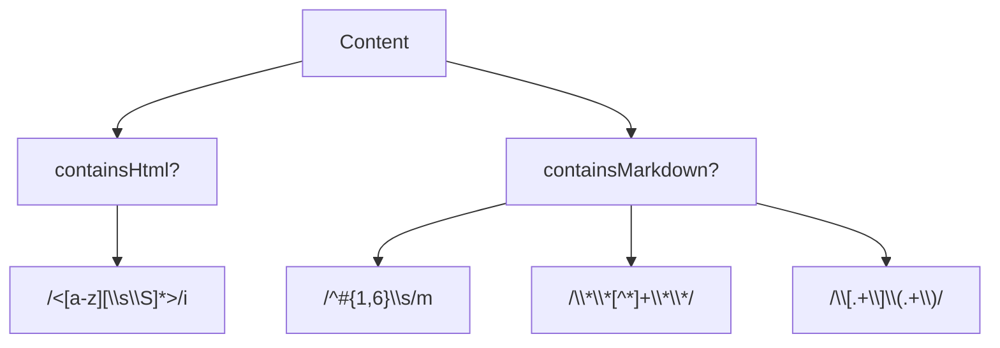

---

## Vector Storage

### Neon PostgreSQL Schema

```sql
-- Enable pgvector extension
CREATE EXTENSION IF NOT EXISTS vector;

-- Embeddings table
CREATE TABLE embeddings_documents (
  id UUID PRIMARY KEY DEFAULT gen_random_uuid(),
  content TEXT,
  metadata JSONB,
  embedding vector(1536)  -- or 3072 for large model
);

-- HNSW index for fast similarity search
CREATE INDEX ON embeddings_documents
  USING hnsw (embedding vector_cosine_ops);

-- GIN index for metadata filtering
CREATE INDEX ON embeddings_documents
  USING gin (metadata);
```

### Vector Dimensions by Model

| Model | Dimensions | Use Case |
|-------|------------|----------|
| `text-embedding-3-small` | 1536 | Fast, cost-effective (default) |
| `text-embedding-3-large` | 3072 | Higher accuracy |
| `text-embedding-ada-002` | 1536 | Legacy |

### Similarity Search

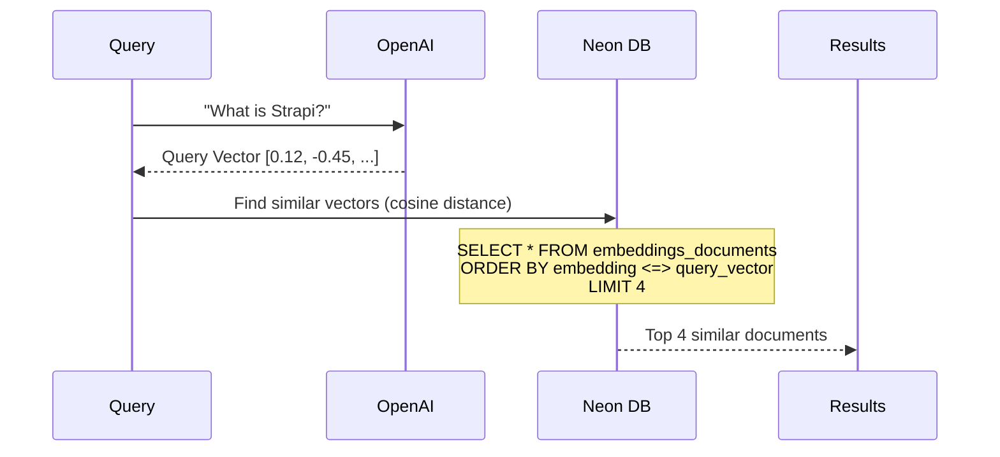

---

## RAG Query Flow

RAG (Retrieval-Augmented Generation) combines search with AI generation.

### Complete RAG Pipeline

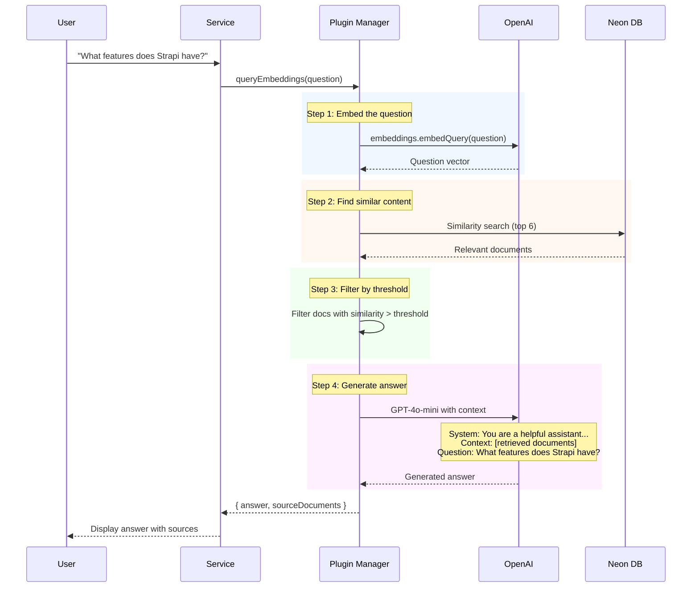

### RAG Prompt Structure

```
┌─────────────────────────────────────────────────────────────┐
│ SYSTEM PROMPT                                               │
│ You are a helpful assistant. Answer questions based on      │
│ the provided context. If you cannot find the answer in      │
│ the context, say "I cannot find the answer."                │
└─────────────────────────────────────────────────────────────┘
                              │
                              ▼
┌─────────────────────────────────────────────────────────────┐
│ CONTEXT (Retrieved Documents)                               │
│                                                             │
│ Document 1: Strapi is a headless CMS that provides...       │
│ Document 2: Key features include content types...           │
│ Document 3: The plugin system allows extending...           │
└─────────────────────────────────────────────────────────────┘
                              │
                              ▼
┌─────────────────────────────────────────────────────────────┐
│ USER QUESTION                                               │
│ What features does Strapi have?                             │
└─────────────────────────────────────────────────────────────┘
                              │
                              ▼
┌─────────────────────────────────────────────────────────────┐
│ AI RESPONSE                                                 │
│ Strapi offers several key features including...             │
└─────────────────────────────────────────────────────────────┘
```

---

## Database Sync

### Sync Operations

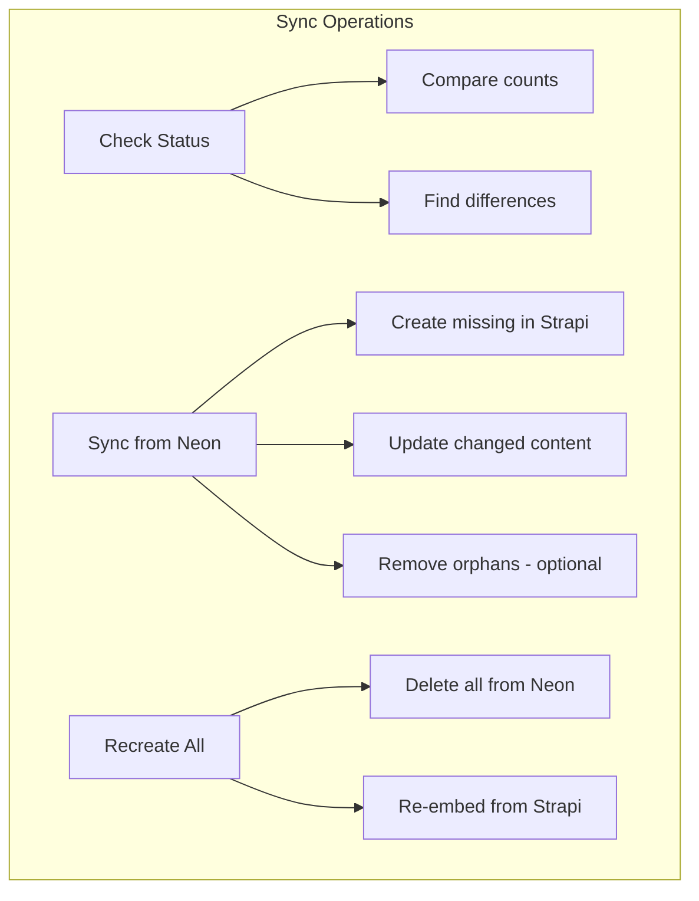

### Sync Flow

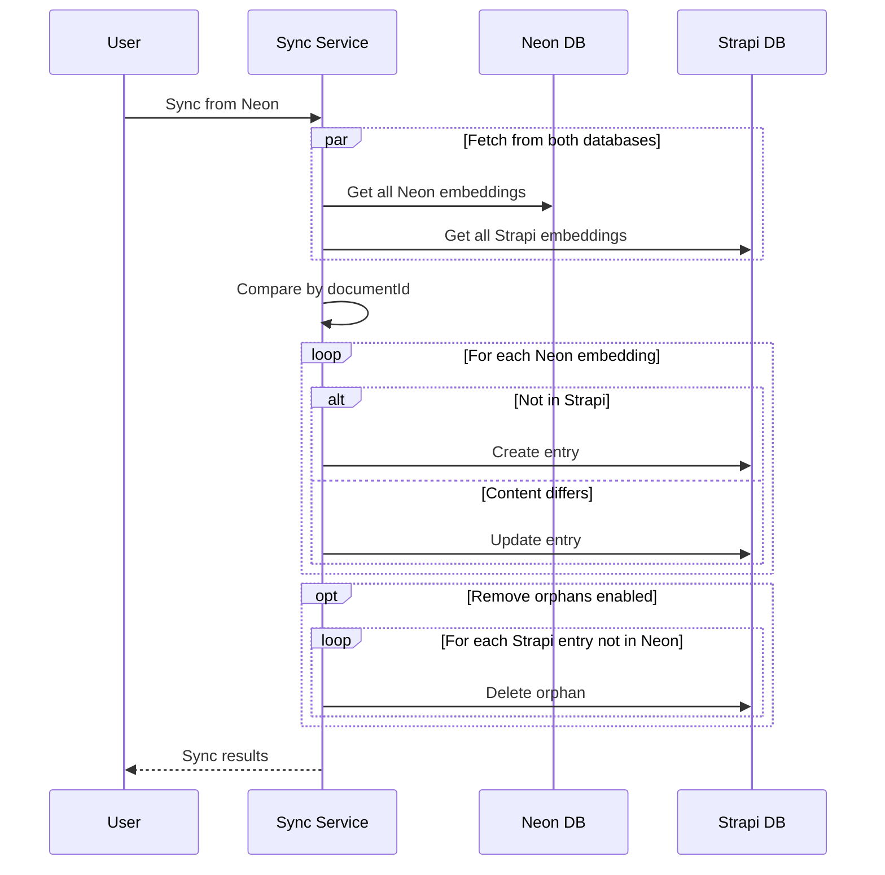

### Sync Status Response

```json
{
  "neonCount": 150,
  "strapiCount": 145,
  "inSync": false,
  "missingInStrapi": 5,
  "missingInNeon": 0,
  "contentDifferences": 2
}
```

---

## MCP Integration

### What is MCP?

MCP (Model Context Protocol) allows AI assistants like Claude Desktop to interact with external tools and data sources.

### MCP Architecture

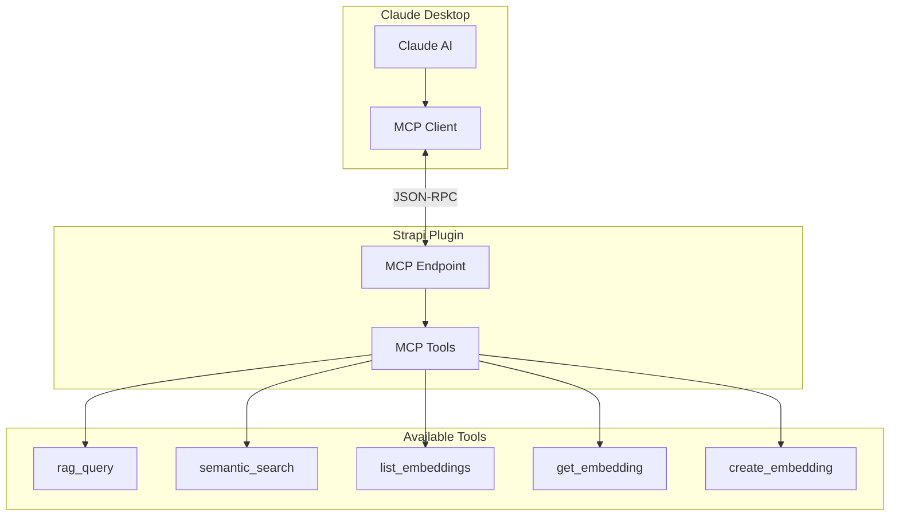

### MCP Request/Response Flow

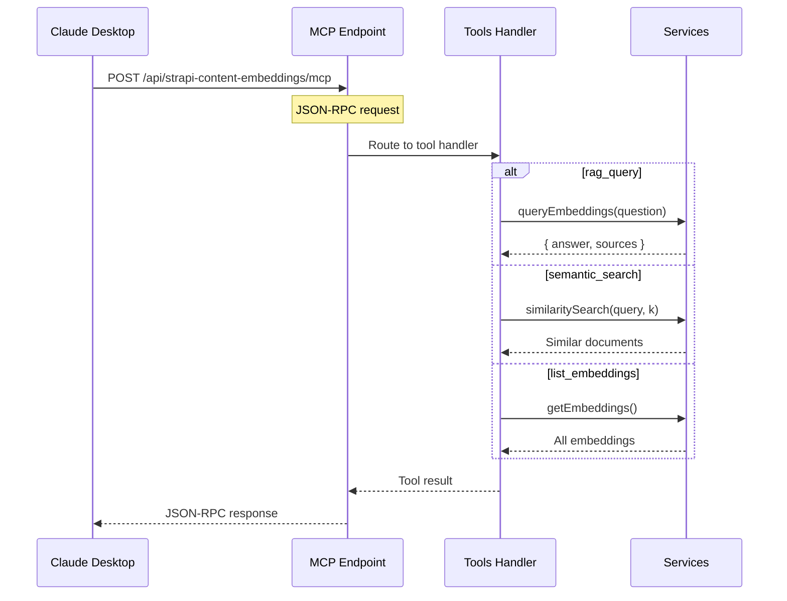

### Claude Desktop Configuration

```json
{
  "mcpServers": {
    "strapi-content-embeddings": {
      "command": "npx",
      "args": [
        "mcp-remote",
        "https://your-strapi.com/api/strapi-content-embeddings/mcp",
        "--header",
        "Authorization: Bearer YOUR_API_TOKEN"
      ]
    }
  }
}
```

---

## File Structure

```
strapi-content-embeddings/
├── admin/src/                    # Frontend (React)
│   ├── components/custom/        # UI Components
│   │   ├── ChatModal.tsx         # RAG chat interface
│   │   ├── EmbeddingsModal.tsx   # Create from content manager
│   │   ├── EmbeddingsTable.tsx   # List view
│   │   ├── MarkdownEditor.tsx    # Content editor
│   │   └── SyncModal.tsx         # Database sync UI
│   ├── pages/                    # Route pages
│   │   ├── HomePage.tsx          # Main listing
│   │   ├── CreateEmbeddings.tsx  # Create form
│   │   └── EmbeddingDetails.tsx  # Detail view
│   └── utils/api.ts              # API client functions
│
├── server/src/                   # Backend (Node.js)
│   ├── controllers/              # HTTP handlers
│   │   ├── controller.ts         # Main API endpoints
│   │   └── mcp.ts                # MCP protocol handler
│   ├── services/                 # Business logic
│   │   ├── embeddings.ts         # CRUD operations
│   │   └── sync.ts               # Database sync
│   ├── utils/                    # Utilities
│   │   ├── chunking.ts           # Text splitting
│   │   └── preprocessing.ts      # HTML/Markdown stripping
│   ├── plugin-manager.ts         # LangChain/OpenAI/Neon
│   ├── routes/                   # Route definitions
│   └── config/                   # Plugin configuration
│
└── docs/                         # Documentation
    └── ARCHITECTURE.md           # This file
```

---

## Key Technologies

| Technology | Purpose |
|------------|---------|
| **LangChain** | AI/LLM framework for embeddings and RAG |
| **OpenAI** | Embedding models (text-embedding-3-small/large) |
| **Neon PostgreSQL** | Serverless Postgres with pgvector |
| **pgvector** | Vector similarity search extension |
| **Strapi v5** | Headless CMS platform |
| **React** | Admin UI framework |

---

## Summary

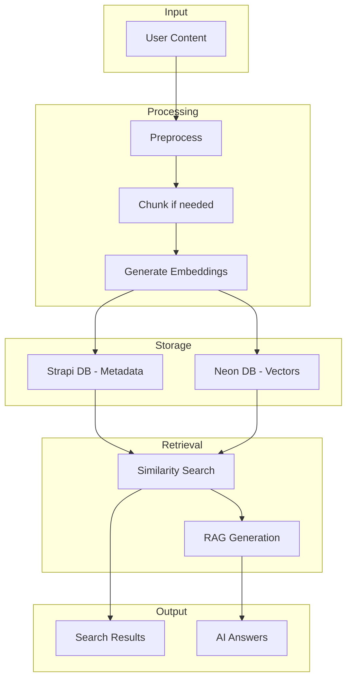

The plugin transforms your Strapi content into a semantic search engine with AI-powered Q&A capabilities, all while maintaining a clean separation between content management (Strapi) and vector operations (Neon).
